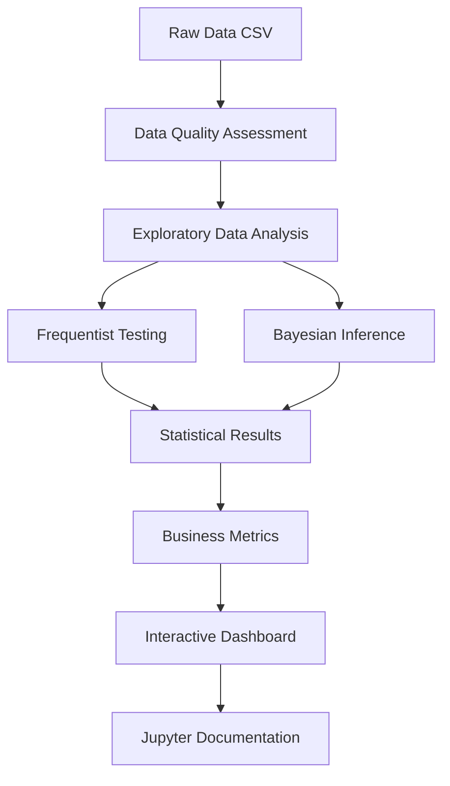

# 📊 Marketing A/B Test Evaluation Platform

<div align="center">

[](https://ramenmachine.github.io/Marketing-A-B-Test---Business-Impact-Analysis/)
[](https://www.python.org/)
[](https://reactjs.org/)
[](https://www.typescriptlang.org/)

**A comprehensive data science platform for rigorous statistical A/B testing analysis**

*Combining advanced statistical methods, machine learning principles, and interactive data visualization*

</div>

---

## 🎯 Overview

This project demonstrates expertise in **data science**, **statistical analysis**, and **machine learning** through a production-ready A/B testing evaluation platform. The system implements both **Frequentist** and **Bayesian** statistical approaches, providing robust analysis of marketing campaign effectiveness with comprehensive business intelligence metrics.

### 🔬 Key Highlights

- **Dual Statistical Frameworks**: Frequentist hypothesis testing + Bayesian inference
- **Advanced Statistical Methods**: T-tests, Chi-square, Bootstrap, Effect size, Power analysis
- **Bayesian Machine Learning**: Beta-Binomial model with Monte Carlo sampling (100,000 samples)
- **Interactive Data Visualization**: Real-time statistical analysis dashboard
- **Business Intelligence**: ROAS, ROI, CPA, and scaling projections
- **Professional Documentation**: Jupyter notebooks with mathematical formulas

---

## 🚀 Live Demo

**[👉 View Interactive Dashboard](https://ramenmachine.github.io/Marketing-A-B-Test---Business-Impact-Analysis/)**

Experience the full platform with interactive visualizations, real-time statistical analysis, and dynamic confidence interval adjustments.

---

## 📈 Statistical & Machine Learning Methods

### Frequentist Statistical Analysis

| Method | Purpose | Implementation |
|--------|---------|----------------|
| **Two-Sample T-Test (Welch's)** | Tests for difference in means with unequal variances | `scipy.stats.ttest_ind()` |
| **Chi-Square Test** | Tests independence between group and conversion | `scipy.stats.chi2_contingency()` |
| **Bootstrap Confidence Intervals** | Non-parametric CI estimation (10,000 resamples) | Custom implementation with NumPy |
| **Effect Size (Cohen's h/d)** | Magnitude assessment independent of sample size | Arcsine transformation for proportions |
| **Statistical Power Analysis** | Probability of detecting true effects | `statsmodels.stats.power.TTestIndPower()` |

**Mathematical Foundation:**
- T-statistic: $t = \frac{\bar{x}_1 - \bar{x}_2}{\sqrt{\frac{s_1^2}{n_1} + \frac{s_2^2}{n_2}}}$
- Effect size: $h = 2 \times (\arcsin(\sqrt{p_1}) - \arcsin(\sqrt{p_2}))$
- Power: $\text{Power} = 1 - \beta = P(\text{reject } H_0 | H_1 \text{ is true})$

### Bayesian Machine Learning

| Component | Description | Implementation |
|-----------|-------------|----------------|
| **Beta-Binomial Model** | Conjugate prior for binary outcomes | `scipy.stats.beta` with Beta(1,1) uniform prior |
| **Posterior Distributions** | Full uncertainty quantification | 100,000 Monte Carlo samples |
| **Credible Intervals** | Probability-based uncertainty | Percentile method from posterior samples |
| **Probability of Superiority** | Direct probability statements | $P(p_{\text{ad}} > p_{\text{psa}} \mid \text{data})$ |

**Bayesian Inference:**
- Prior: $\text{Beta}(\alpha, \beta)$ where $\alpha = \beta = 1$ (uniform)
- Posterior: $\text{Beta}(\alpha + \text{successes}, \beta + \text{failures})$
- Posterior Mean: $E[p \mid \text{data}] = \frac{\alpha + \text{successes}}{\alpha + \beta + \text{total trials}}$

### Advanced Analytics

- **Temporal Pattern Analysis**: Day/hour effects using time series analysis
- **Dose-Response Analysis**: Correlation between ad exposure and conversion (Pearson & Spearman)
- **Exploratory Data Analysis**: Comprehensive data quality assessment
- **Scaling Projections**: Revenue forecasting using statistical models

---

## 🛠️ Technology Stack

### Data Science & Machine Learning

<div align="center">

| Category | Technologies |
|----------|-------------|
| **Statistical Computing** | Python 3.8+, NumPy, SciPy, Statsmodels |
| **Data Manipulation** | Pandas |
| **Statistical Modeling** | SciPy.stats, Statsmodels.stats.power |
| **Bayesian Inference** | Beta-Binomial model, Monte Carlo sampling |
| **Data Visualization** | Matplotlib, Seaborn |
| **Interactive Analysis** | Jupyter Notebooks |

</div>

### Frontend Development

<div align="center">

| Category | Technologies |
|----------|-------------|
| **Framework** | React 18.2, TypeScript 5.0+ |
| **Build Tool** | Vite 5.0 |
| **Data Visualization** | Recharts 2.10 |
| **Styling** | Tailwind CSS, Glassmorphism UI |
| **Icons** | Lucide React |

</div>

### Development Tools

- **Version Control**: Git, GitHub
- **Package Management**: npm, pip
- **Documentation**: Markdown, LaTeX (for mathematical formulas)

---

## 📊 Project Structure

```
Marketing-A-B-Test---Business-Impact-Analysis/
├── 📓 Jupyter Notebooks (Data Science Analysis)
│   ├── ab_test_eda.ipynb              # Exploratory Data Analysis
│   ├── ab_test_frequentist.ipynb      # Frequentist Statistical Tests
│   ├── ab_test_bayesian.ipynb         # Bayesian Machine Learning
│   └── ab_test_business_impact.ipynb   # Business Intelligence Metrics
│
├── 🐍 Python Scripts (Statistical Analysis)
│   ├── ab_test_eda.py                 # EDA automation
│   ├── ab_test_frequentist.py         # Frequentist tests
│   ├── ab_test_bayesian.py            # Bayesian inference
│   └── ab_test_business_impact.py     # Business metrics
│
├── ⚛️ React Frontend (Interactive Dashboard)
│   ├── src/
│   │   ├── ab_test_dashboard.tsx      # Main dashboard component
│   │   ├── main.jsx                   # Application entry point
│   │   └── index.css                  # Glassmorphism styling
│   └── public/                        # Static assets & JSON results
│
└── 📚 Documentation
    ├── README.md                      # This file
    ├── ab_test_prd.md                 # Product requirements
    ├── PROJECT_SUMMARY.md             # Executive summary
    └── docs/
        ├── STATISTICAL_METHODS.md     # Statistical methods guide
        └── DEPLOYMENT.md              # Deployment instructions
```

---

## 🔬 Statistical Analysis Workflow



### Analysis Pipeline

1. **Data Loading & Quality Checks**
   - Missing value detection
   - Duplicate identification
   - Data consistency validation

2. **Exploratory Data Analysis**
   - Conversion rate analysis
   - Temporal pattern identification
   - Dose-response relationships
   - Correlation analysis

3. **Statistical Testing**
   - **Frequentist**: T-test, Chi-square, Bootstrap, Effect size, Power analysis
   - **Bayesian**: Beta-Binomial model, Posterior sampling, Credible intervals

4. **Business Intelligence**
   - Incremental conversions
   - ROAS, ROI, CPA calculation
   - Break-even analysis
   - Scaling projections

5. **Visualization & Reporting**
   - Interactive dashboard
   - Jupyter notebooks with formulas
   - Exportable results

---

## 📈 Key Metrics & Results

### Statistical Metrics

- **P-value**: Statistical significance testing
- **Effect Size**: Cohen's h and d for magnitude assessment
- **Confidence Intervals**: 90%, 95%, 99% (adjustable)
- **Statistical Power**: Probability of detecting true effects
- **Probability of Superiority**: Bayesian probability statements

### Business Intelligence Metrics

- **ROAS (Return on Ad Spend)**: Revenue per dollar spent
- **ROI (Return on Investment)**: Net profit relative to investment
- **CPA (Cost per Acquisition)**: Cost per incremental conversion
- **Break-Even Analysis**: Minimum performance thresholds
- **Scaling Projections**: Revenue forecasts at different volumes

---

## 🎓 Data Science Skills Demonstrated

### Statistical Analysis
- ✅ Hypothesis testing (t-test, chi-square)
- ✅ Bayesian inference (Beta-Binomial model)
- ✅ Bootstrap methods
- ✅ Effect size calculation
- ✅ Power analysis
- ✅ Confidence/Credible intervals

### Machine Learning
- ✅ Probabilistic modeling
- ✅ Monte Carlo sampling
- ✅ Posterior distribution estimation
- ✅ Uncertainty quantification

### Data Engineering
- ✅ Data quality assessment
- ✅ Temporal pattern analysis
- ✅ Correlation analysis
- ✅ Time series analysis

### Data Visualization
- ✅ Interactive dashboards
- ✅ Statistical plots
- ✅ Business metrics visualization
- ✅ Real-time updates

---

## 🚀 Quick Start

### Prerequisites

```bash
# Python 3.8+
python --version

# Node.js 16+
node --version

# npm
npm --version
```

### Installation

```bash
# 1. Clone repository
git clone https://github.com/RamenMachine/Marketing-A-B-Test---Business-Impact-Analysis.git
cd Marketing-A-B-Test---Business-Impact-Analysis

# 2. Install Python dependencies
pip install pandas numpy scipy matplotlib seaborn statsmodels jupyter

# 3. Install Node.js dependencies
npm install

# 4. Run analysis (optional - generates JSON for dashboard)
python ab_test_eda.py
python ab_test_frequentist.py
python ab_test_bayesian.py
python ab_test_business_impact.py

# 5. Start development server
npm run dev
```

### Running Jupyter Notebooks

```bash
jupyter notebook
# Open and run:
# - ab_test_eda.ipynb
# - ab_test_frequentist.ipynb
# - ab_test_bayesian.ipynb
# - ab_test_business_impact.ipynb
```

---

## 📚 Jupyter Notebooks

Each notebook contains comprehensive analysis with:

- **Mathematical Formulas**: LaTeX-formatted equations
- **Statistical Explanations**: Step-by-step methodology
- **Code Implementation**: Production-ready Python
- **Visualizations**: Professional charts and graphs
- **Interpretations**: Results explanation and recommendations

| Notebook | Focus Area | Key Methods |
|----------|-----------|-------------|
| `ab_test_eda.ipynb` | Exploratory Analysis | Data quality, temporal patterns, dose-response |
| `ab_test_frequentist.ipynb` | Frequentist Statistics | T-test, Chi-square, Bootstrap, Effect size, Power |
| `ab_test_bayesian.ipynb` | Bayesian ML | Beta-Binomial, Posterior sampling, Credible intervals |
| `ab_test_business_impact.ipynb` | Business Intelligence | ROAS, ROI, CPA, Break-even, Scaling |

---

## 📊 Sample Analysis Output

### Frequentist Results
- T-statistic and p-value
- 95% Confidence intervals
- Effect size (Cohen's h/d)
- Statistical power

### Bayesian Results
- Posterior distributions
- 95% Credible intervals
- Probability of superiority
- Expected business impact

### Business Metrics
- Incremental conversions
- ROAS and ROI
- Cost per acquisition
- Break-even analysis

---

## 🎯 Use Cases

- **Marketing Analytics**: Evaluate campaign effectiveness
- **Product Development**: A/B test new features
- **Data Science Research**: Statistical methodology demonstration
- **Business Intelligence**: Revenue attribution and forecasting
- **Academic**: Statistical methods and machine learning

---

## 📄 License

This project is licensed under the MIT License - see the [LICENSE](LICENSE) file for details.

---

## 👤 Author

**RamenMachine**

- GitHub: [@RamenMachine](https://github.com/RamenMachine)
- Repository: [Marketing-A-B-Test---Business-Impact-Analysis](https://github.com/RamenMachine/Marketing-A-B-Test---Business-Impact-Analysis)

---

<div align="center">

**Built with ❤️ using Python, React, and advanced statistical methods**

[](https://github.com/RamenMachine/Marketing-A-B-Test---Business-Impact-Analysis)
[](https://github.com/RamenMachine/Marketing-A-B-Test---Business-Impact-Analysis)

</div>
